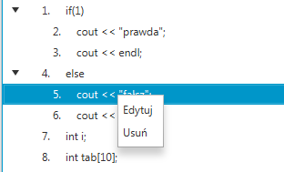

# praca-licencjacka2019
Interpreter do nauki języka C++ poprzez programowanie wizualne. Praca licencjacka 2019.

Program wprowadza się korzystając z UI. Możliwe jest natychmiastowe wykonywanie programów oraz wykonywanie krokowe. Po lewej podgląd wartości zmiennych. W każdym momencie można cofnąć wykonany krok lub dokonać modyfikacji programu.

